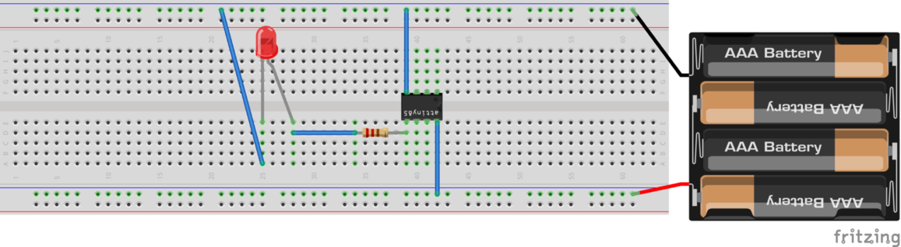

# microcontroller

## RIOT-OS
* an OS for IoT
* runs on ARM, ESP32, ESP8266, ...
* https://github.com/RIOT-OS/RIOT
* 

### setup VirtualBox Image for RIOT development
* https://github.com/RIOT-OS/RIOT/wiki/Howto%3A-Create-a-VirtualBox-Image-for-RIOT-development

## AVR: ATtiny85
__tools__
* dmesg: list kernel ring buffer
* lsusb: list usb devices
* avrdude: for programmer, transfer code from computer to microcontroller
* gcc-avr: compiler for AVR
* avr-libc: AVR C library
* _optional tools_
    * binutils-avr: tools like assembler, linker
    * gdb-avr: debugger for 

### example: main.c

* Step 1: we need to bring our program to uC (microcontroller)
* Step 2: run the uC

__Step 1: compile, build and flash__

In order to bring our program to the uC we need a elf format. To be short. These are the steps for it: 
```
avr-gcc -mmcu=attiny85 -Os -c main.c  -o main.o
avr-gcc main.o -o main.elf
avr-objcopy -O ihex -j .text -j .data main.elf main.hex
avr-size --mcu=attiny85 -C main.elf 
avrdude -p attiny85 -c usbasp -U flash:w:main.hex:a
``` 

The connection between the computer and microcontroller is done with a programmer. In my case its a _USBasp_. For more: https://fischl.de/.

Usually the _USBasp_ will have a ISP 10 pin cable witch is wired to the relevant pins in ATtiny85.

_AVRISP mkII_ is also a good choice. It's just hard to find a original one and its expensive. You also have to extra power you uC.

__Step 1: running__
After flashing process the program is loaded into the ATtiny85. Wire a circuit with a led to PIN 5 on ATtiny85 and power it up.

__circuit__
* the led will glow every 500ms with flashed main.c example


__cheatsheet__
* list supported uController: `avrdude -p?`
* check connection between programmer (e.g. USBasp, AVRISP, ...): `avrdude -p attiny85 -c usbasp` or `avrdude -p t85 -c usbasp`

__electricity__
* power-bus in breadboard (+ and - lines)
* red cable is +
* black cable is -
* integrated circuit (IC) = chips comes with DIP (dual in-line package) for the middle gab in breadboard

__Atmel ATTiny85__

```
Reset	1	8	VCC (5V)
		2	7	SCK
		3	6	MISO
GND		4	5	MOSI
```

__Serial Peripheral Interface__
* SCK: Serial Clock
* MOSI: Master Output Slave Input
* MISO: Master Input Slace Output

__USB to TTL Serialadapter__
* check connection with `dmesg`
* connect with `minicom`
* convert TTL logic to RS232
* USB serial converter

__ISP AVR__
* 10 or 6 pins
* In System Programming
* use with: `avrdude -p attiny85 -c avrispmkII`

## ESP32 (M5Stack)
* ESP32 is implemented in M5Stack
* Espressif ESP32 is the successor of Espressif ESP8266
* example based on linux (ubuntu)

### PlatformIO
* install PlatformIO as extension in vscode or atom

### create new project
* Board: M5Stack Core ESP32
* Framework: Arduino

### run (ide)
* build 'PlatformIO: Build'
* upload 'PlatformIO: Upload'

### run (command line)
```
pio run
```

### throubleshooting
__Issue__
```
[Errno 13] Permission denied: '/dev/ttyUSB0'
```
__Solution__
```
sudo chmod 666 /dev/ttyUSB0
```

